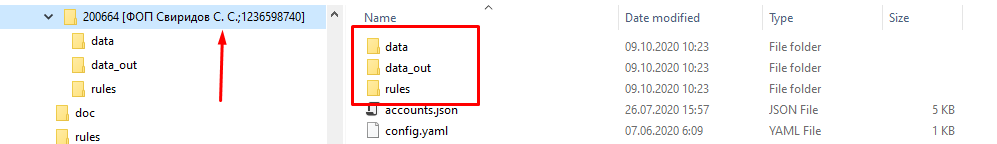

# Bank Statements Export tool
## Purpose
Export statements from Bank Statements (usually XLS file) into set of json files, feed those files to [Taxer API](https://github.com/maxsivkov/py-taxer-api). Because this project is actual for ukrainians, all documentation pages are in russian.

## Languages/frameworks
- Python 3.7 or later
- [swagger codegen](https://swagger.io/tools/swagger-codegen/) для создания SDK

## Описание
Экспорт данных из банковский выписки в файлы json для последующего импорта этих файлов в taxer.ua посредством [Taxer API](https://github.com/maxsivkov/py-taxer-api), либо какойто другой машинной обработки.  
В данный момент потдерживаются выписки генерируемые Privat24 для бизнеса, однако возможна интеграция с другими типами выписок

## Статус
- Стадия прототипирования
- Функционал  
  * Парсинг банковской выписки
  * С помощью системы правил определяется тип операции
  * Формируются файлы в формате json в которых присутствуют все данные по операции 
  * Загрузка json файлов посредством [Taxer API](https://github.com/maxsivkov/py-taxer-api) в taxer.ua 

## Как работает  
- Приложение коммандной строки, все управление осуществляется путем задания аргументов (в коммандной строке либо посредством конфигурационных файлов))
- Для загрузки json файлов в таксер необходимо поднять АПИ сервер [Taxer API](https://github.com/maxsivkov/py-taxer-api)
- В корне проекта есть файл `config.yaml`, в котором указывается корневая папка для данных пользователя (параметр `accounts_folder`). В этой папке будет создана структура каталогов для работы софта (подпапки для юзеров, папка для входных файлов и папка для выходных файлов). А также адрес TaxerAPI (параметр `taxerapi_url`)
- Параметры `accounts_folder` и `taxerapi_url` также можно задавать через коммандную строку (см. `python main.py --help`) или через переменные окружения (`BSTMT_ACCOUNTS_DIR` и `BSTMT_TAXER_API_URL` соответственно)
-    
## Как установить
 * [На десктопе](doc/how-to-install-desktop.md)
 * [Через Docker](doc/how-to-install-docker.md)

## Как запускать
 * [На десктопе](doc/how-to-run-desktop.md)
 * [Через Docker](doc/how-to-run-docker.md)

## Порядок действий
- Запустить АПИ сервер [Taxer API](https://github.com/maxsivkov/py-taxer-api)
- Инициализация данных по ФОПам (это нужно сделать один раз, либо выполнять каждый раз когда меняются реквизиты ФОПа - например добавляются счета)  
  ```
  python main.py init
  ```  
  В результате в папке, на которую указывает `accounts_folder` должен появиться каталог для данных ФОПа, чтото типа такого:  
  
- Зайти на Приват24 для бизнеса, раздел счета и выписки - выбираем все счета - Выписка - указываем период по кварталу:  
  __I__   : 01.01.2020 - 31.03.2020  
  __II__  : 01.04.2020 - 31.06.2020  
  __III__ : 01.07.2020 - 30.09.2020  
  __IV__  : 01.10.2020 - 31.12.2020  
  и экспорт в xls файл. Файл нужно поместить в подпапку `data` которая нахордится в папке ФОПа 
- Выполнить 
  ```
  python main.py process
  ```
  для создания json файлов. Они создаются в каталоге `data_out`  
  По окончании операции в консоль напишется сколько обработалось операций  
  
  __!ВНИМКАНИЕ!__ в поле Комментарий каждой операции вставляется тег вида IMP-YYYY-MM-DD, где YYYY - текущий год, MM - текущий месяц, DD - текущий день. Это сделано для того чтобы можно было впоследствии найти все операции по текущей дате в таксере и например удалить, если чтото пошло не так.   
  
  Там же будет помещен xlsx файл, в котором в первой колонке будет указан результат операции (ячейки раскрашиваются разными цветами. Тут нужно убедиться что в 1й колонке отсутствуют нераскрашенные ячейки. Если ячейка белая, это значит что по этой записи операция небыла создана.
- Выполнить 
  ```
  python main.py push
  ```
  для загрузки json файлов на сервер taxer.ua посредством [Taxer API](https://github.com/maxsivkov/py-taxer-api)
  По окончании операции в консоль напишется сколько обработалось операций  
  Теперь можно перейти в веб интерфейс таксера и проверить что все норм.  


## Справка по коммандам

Запуск: main.py <action> где action:

**init** - инициализация (создает структуру локальных каталогов, вытаскивает данные по ФОПу - атрибутику, счета). Требуется выполнять когда изменяется любая инфа по ФОПу в таскере

**process** - обработка входных файлов (xls или xlsx), формирование файлов с операциями в json формате для последующей передачи

**push** - загрузка файлов с операциями в json формате через апи в таскер